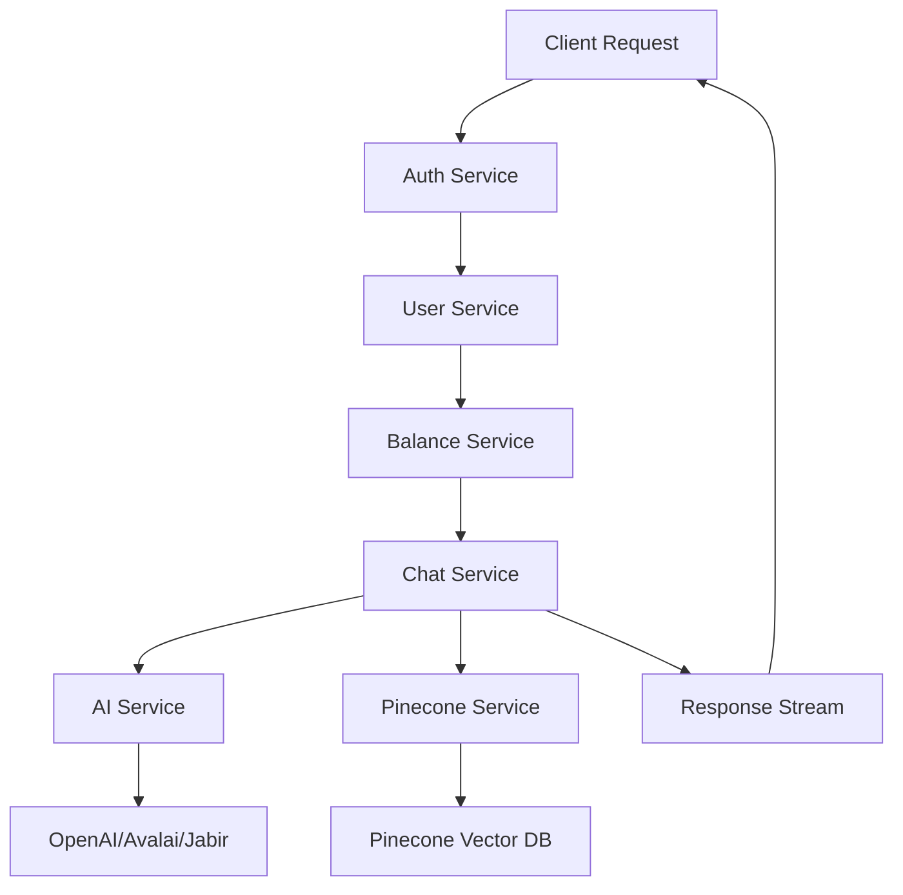

# Services Package

## Overview

The `services` package contains the core business logic and service layer for the **Go Internist** medical AI assistant application. It implements a modular service architecture that handles AI-powered medical consultations, user management, authentication, and system administration.

## Architecture

The services are organized into specialized packages that work together to provide comprehensive medical AI functionality:

```
services/
├── ai/                    # AI provider integration (OpenAI, etc.)
├── chat/                  # Medical chat with RAG capabilities
├── pinecone/              # Vector database operations
├── sms/                   # SMS verification and notifications
├── user_services/         # User management and authentication
├── admin_services/        # Administrative operations
├── ai_service.go         # Main AI service coordinator
├── chat_service.go       # Chat service coordinator
├── pinecone_service.go   # Pinecone service coordinator
├── sms_service.go        # SMS service coordinator
└── logger.go             # Shared logging interface
```


## Core Services

### 🤖 AI Services (`ai/`)

**Medical AI provider integration and management**

- Multiple AI provider support (OpenAI, Avalai, Jabir)
- Configurable models and parameters
- Token usage tracking and optimization
- Error handling and retry mechanisms
- **[📖 Detailed Documentation](ai/README.md)**


### 💬 Chat Services (`chat/`)

**Intelligent medical consultation system**

- RAG (Retrieval-Augmented Generation) for medical knowledge
- Real-time streaming responses
- Context management for conversations
- Source attribution and medical references
- Persian and English language support
- **[📖 Detailed Documentation](chat/README.md)**


### 🗄️ Pinecone Services (`pinecone/`)

**Vector database operations for medical knowledge**

- Medical document embedding storage
- Semantic search and retrieval
- Namespace management for different medical domains
- Batch operations and performance optimization
- **[📖 Detailed Documentation](pinecone/README.md)**


### 📱 SMS Services (`sms/`)

**SMS verification and notifications**

- User phone verification workflows
- SMS.ir provider integration
- Rate limiting and retry logic
- Template-based messaging
- **[📖 Detailed Documentation](sms/README.md)**


### 👥 User Services (`user_services/`)

**Comprehensive user management system**

- Authentication and authorization
- Credit and balance management
- Account security and lockout protection
- SMS verification workflows
- Admin user management
- **[📖 Detailed Documentation](user_services/README.md)**


### 🔧 Admin Services (`admin_services/`)

**System administration and monitoring**

- User management dashboard
- System statistics and analytics
- Configuration management
- Maintenance operations


## Service Coordinators

### Main Service Files

- **`ai_service.go`**: Coordinates AI provider operations
- **`chat_service.go`**: Orchestrates chat functionality with RAG
- **`pinecone_service.go`**: Manages vector database operations
- **`sms_service.go`**: Handles SMS operations and verification


## Features

### 🏥 Medical AI Capabilities

- **Multi-provider AI integration**: Support for OpenAI, Avalai, and Jabir
- **RAG-powered responses**: Contextual answers using medical literature
- **Streaming responses**: Real-time chat experience
- **Medical source attribution**: Traceable medical references


### 🔐 Security \& User Management

- **JWT-based authentication**: Secure token-based auth
- **SMS verification**: Phone number verification workflows
- **Account lockout protection**: Brute force attack prevention
- **Role-based access control**: Admin and user privilege separation


### 💳 Credit System

- **Flexible subscription tiers**: Basic, Premium, Pro plans
- **Usage-based billing**: Character-based credit deduction
- **Balance management**: Credit tracking and renewal
- **Admin credit controls**: Manual credit adjustments


### 🌐 Multi-language Support

- **Persian language support**: Native Farsi interface and responses
- **English language support**: International accessibility
- **Automatic language detection**: Smart language switching


## Quick Start

### Service Initialization

```go
package main

import (
    "log"
    "github.com/iyunix/go-internist/internal/config"
    "github.com/iyunix/go-internist/internal/services"
    "github.com/iyunix/go-internist/internal/services/user_services"
    "github.com/iyunix/go-internist/internal/services/admin_services"
)

func initializeServices(cfg *config.Config, logger services.Logger) {
    // Initialize core services
    aiService := services.NewAIService(cfg.AI, logger)
    pineconeService := services.NewPineconeService(cfg.Pinecone, logger)
    smsService := services.NewSMSService(cfg.SMS, logger)
    
    // Initialize user services
    userService := user_services.NewUserService(userRepo, cfg.JWT.SecretKey, cfg.AdminPhone, logger)
    authService := user_services.NewAuthService(userRepo, cfg.JWT.SecretKey, cfg.AdminPhone, logger)
    balanceService := user_services.NewBalanceService(userRepo, logger)
    
    // Initialize chat service with RAG
    chatService := services.NewChatService(aiService, pineconeService, logger)
    
    // Initialize admin service
    adminService := admin_services.NewAdminService(userService, balanceService, logger)
}
```


### Basic Usage Examples

#### Medical Chat Query

```go
// Process medical consultation
response, err := chatService.ProcessQuery(ctx, &chat.QueryRequest{
    UserID:   userID,
    Message:  "What are the symptoms of diabetes?",
    Language: "en",
})
if err != nil {
    log.Printf("Chat error: %v", err)
    return
}

// Stream response to client
for chunk := range response.Stream {
    fmt.Print(chunk.Content)
}
```


#### User Authentication

```go
// User login
user, token, err := authService.Login(ctx, "username", "password")
if err != nil {
    log.Printf("Login failed: %v", err)
    return
}

// Validate JWT token
userID, err := authService.ValidateJWTToken(token)
if err != nil {
    log.Printf("Invalid token: %v", err)
    return
}
```


#### Credit Management

```go
// Check user balance before query
canAsk, charge, err := userService.CanUserAskQuestion(ctx, userID, len(question))
if err != nil || !canAsk {
    log.Printf("Insufficient balance")
    return
}

// Deduct credits after successful query
actualCharge, err := userService.DeductCharactersForQuestion(ctx, userID, len(question))
if err != nil {
    log.Printf("Credit deduction failed: %v", err)
}
```


## Configuration

### Environment Variables

```bash
# AI Service Configuration
AI_PROVIDER=openai
OPENAI_API_KEY=your_openai_key
AI_MODEL=gpt-4
AI_MAX_TOKENS=2000

# Pinecone Configuration
PINECONE_API_KEY=your_pinecone_key
PINECONE_ENVIRONMENT=us-west1-gcp
PINECONE_INDEX_NAME=medical-knowledge

# SMS Configuration
SMS_PROVIDER=sms.ir
SMS_API_KEY=your_sms_key
SMS_FROM_NUMBER=+1234567890

# User Service Configuration
JWT_SECRET=your_jwt_secret
ADMIN_PHONE=+1234567890
```


### Service Dependencies

```go
// Required dependencies for full service initialization
type ServiceDependencies struct {
    Config       *config.Config
    UserRepo     repository.UserRepository
    ChatRepo     repository.ChatRepository
    MessageRepo  repository.MessageRepository
    Logger       services.Logger
    Database     *gorm.DB
}
```


## Service Communication Flow




## Error Handling

All services implement comprehensive error handling with:

- **Structured errors**: Domain-specific error types
- **Error wrapping**: Context preservation through error chains
- **Retry mechanisms**: Automatic retry with exponential backoff
- **Circuit breakers**: Service protection from cascading failures
- **Monitoring**: Error rate tracking and alerting


## Testing

### Unit Tests

Each service package includes comprehensive unit tests:

```bash
# Run all service tests
go test ./internal/services/...

# Run specific service tests
go test ./internal/services/chat/...
go test ./internal/services/user_services/...
```


### Integration Tests

```bash
# Run integration tests
go test -tags=integration ./internal/services/...
```


## Monitoring \& Observability

### Key Metrics

- **AI API Response Times**: Track AI provider performance
- **Chat Response Quality**: Monitor user satisfaction
- **User Authentication Success**: Track login success rates
- **Credit Usage Patterns**: Monitor billing and usage
- **System Resource Usage**: Monitor service health


### Health Checks

```go
// Service health check endpoints
GET /health/ai        # AI service status
GET /health/pinecone  # Vector DB connectivity
GET /health/sms       # SMS service availability
GET /health/user      # User service status
```


## Performance Optimization

### Caching Strategy

- **AI Response Caching**: Cache common medical queries
- **User Session Caching**: Redis-based session storage
- **Vector Search Caching**: Cache frequent medical lookups


### Resource Management

- **Connection Pooling**: Database and external API connections
- **Rate Limiting**: Prevent service overload
- **Batch Processing**: Efficient bulk operations


## Security Considerations

### Data Protection

- **Encryption**: All sensitive data encrypted at rest and in transit
- **Access Control**: Role-based permissions and audit logging
- **API Security**: Rate limiting and authentication on all endpoints


### Medical Data Compliance

- **HIPAA Compliance**: Healthcare data protection standards
- **Data Anonymization**: User privacy protection
- **Audit Trails**: Complete operation logging for compliance


## Development Guidelines

### Adding New Services

1. Create service package in appropriate subdirectory
2. Implement service interface with dependency injection
3. Add comprehensive unit tests and documentation
4. Update service initialization and configuration
5. Add health checks and monitoring

### Service Interface Design

```go
// Standard service interface pattern
type ServiceInterface interface {
    Initialize(ctx context.Context) error
    HealthCheck(ctx context.Context) error
    Shutdown(ctx context.Context) error
}
```


## Contributing

1. Follow the established service patterns
2. Add comprehensive tests for new functionality
3. Update documentation for service changes
4. Ensure proper error handling and logging
5. Add configuration options for new features

## Support

For detailed service-specific documentation, refer to the individual README files in each service directory:

- [AI Services Documentation](ai/README.md)
- [Chat Services Documentation](chat/README.md)
- [Pinecone Services Documentation](pinecone/README.md)
- [SMS Services Documentation](sms/README.md)
- [User Services Documentation](user_services/README.md)
<span style="display:none">[^1][^2][^3][^4][^5][^6][^7][^8]</span>

<div style="text-align: center">⁂</div>

[^1]: https://go.dev/doc/modules/layout

[^2]: https://github.com/golang-standards/project-layout

[^3]: https://www.reddit.com/r/golang/comments/1dezksp/golang_folder_structure_for_mid_size_project/

[^4]: https://www.alexedwards.net/blog/11-tips-for-structuring-your-go-projects

[^5]: https://dev.to/ayoubzulfiqar/go-the-ultimate-folder-structure-6gj

[^6]: https://go.dev/doc/effective_go

[^7]: https://templ.guide/project-structure/project-structure/

[^8]: https://avivcarmi.com/finding-the-best-go-project-structure-part-1/

